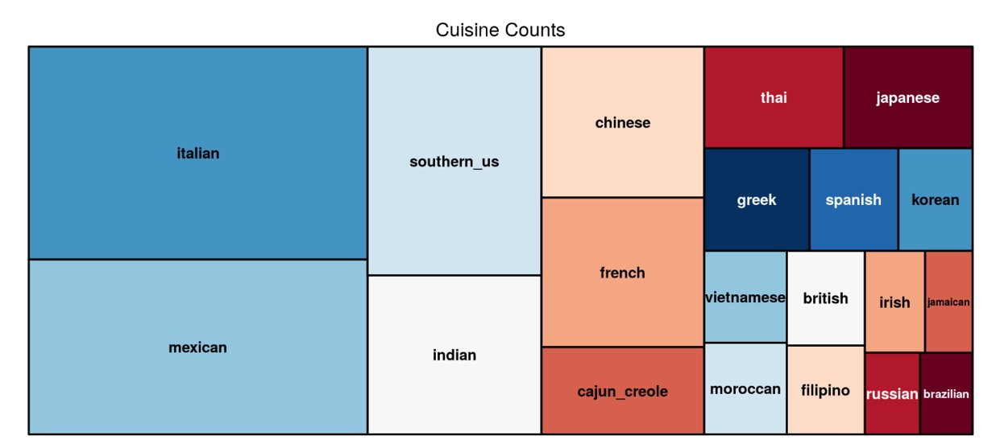

## 我們想知道來自世界各地的料理，最常使用哪些食材

  

### 根據上圖，我們選擇分析以下前六大料理的食材。

   1.Italian
   
   2.Mexican
   
   3.Southen_US
   
   4.Indian
   
   5.Chinese
   
   6.French
   
   
## 資料視覺化

  * 於排行榜頁面中
  
    呈現菜色最多樣的料理、最常被使用的食材使用最多種食材的料理
  
  
  
  * 於世界頁面中
  
    呈現出全世界使用最廣泛的食材前7名，通常與哪些食材一起使用
    
  
  * 於異國料理頁面中
     
    呈現該種料理最常使用的食材、前六大料理中各食材間的關係

   

